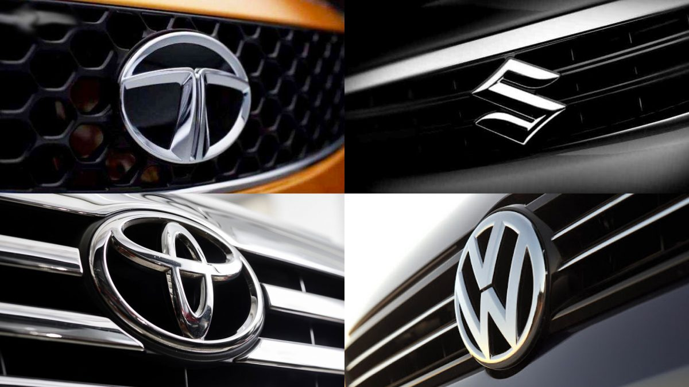
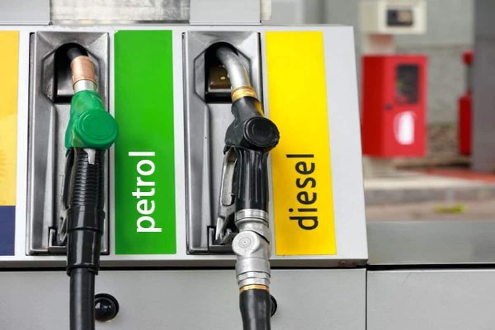

# Used Cars Market Analysis

## Project Overview
Analysis of Indian used car market data using Python, focusing on price trends and market preferences.

## Key Analysis Areas

### 1. Brand Distribution Analysis
- Analyzed frequency of different car brands in the market
- Identified most popular brands in the used car market
- Found correlations between brand and pricing
- 
  
### 2. Fuel Type Preferences
- Studied distribution of fuel types (Petrol, Diesel, CNG)
- Analyzed price variations across fuel types
- Identified market preferences

### 3. Market Value Correlations
- Investigated factors affecting car prices
- Found strong correlation between age and price
- Analyzed impact of kilometers driven on value

## Tools Used
- Python (Pandas, NumPy)
- Data Visualization (Matplotlib, Seaborn)
- Statistical Analysis (SciPy)

## Visualizations
1. Brand Distribution Plot
2. Fuel Type Distribution
3. Price vs Age Correlation
4. Kilometers Driven Analysis

## Author
Thonta Mahesh
- Global Catalog Associate at Amazon
- Data Analysis Enthusiast
- [LinkedIn](https://www.linkedin.com/in/thontamahesh/)
- [Email](mailto:maheshthonta9247@gmail.com)
